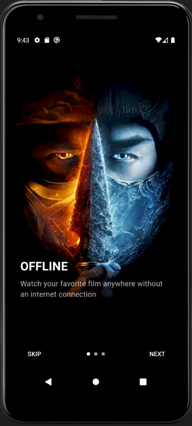
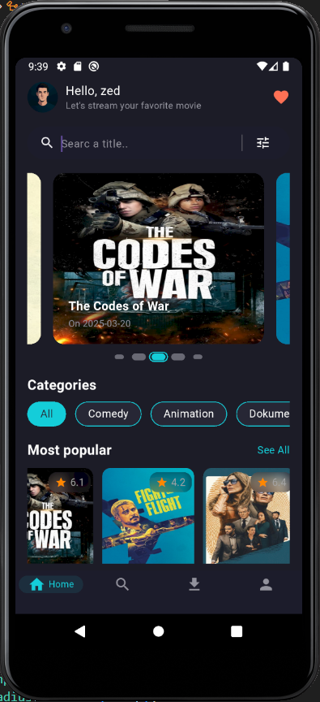
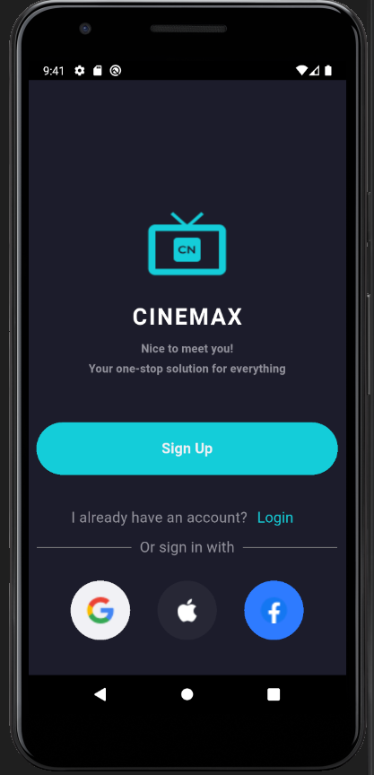

# 🎬 CineMax Movie App

Welcome to **CineMax Movie App** – a beautifully designed cinematic Flutter application where you can explore trending movies, search for your favorites, and view stunning details for each title. Built with clean architecture and powerful state management, it provides both style and scalability.

<p align="center">
  
    
  
</p>

---


## 🛠️ Technologies Used

| Tech               | Purpose                               |
|--------------------|---------------------------------------|
| 💙 **Flutter**      | Cross-platform UI development       |
| 🔥 **Firebase Auth**| User authentication                 |
| 🧊 **Dio**          | HTTP requests                       |
| 🚀 **Retrofit**     | Networking and API generation       |
| ❄️ **Freezed**       | Immutable data classes             | 
| ⚡ **BLoC/Cubit**    | State management                   |
| 🧠 **GetIt**         | Dependency injection               |
| 🖼️ **ScreenUtil**    | Responsive UI                      |

---

## 📦 Project Architecture
<pre> ``` lib/
├── core/
│   ├── DI (GetIt)
│   ├── Networking (Dio + Retrofit)
│   ├── Routing
│   ├── Helpers
│   ├── Theming
│   └── Widgets
│
├── Features/
│   └── home/
│       ├── data/
│       │   ├── models
│       │   └── repo
│       ├── logic/
│       │   └── cubit & states
│       └── ui/
│           └── screens & widgets```/pre>

---

## 🧑‍💻 Getting Started

### 🔧 Prerequisites

- Flutter (>=3.10)
- Firebase Project with Auth enabled
- TMDB API key

### ⚙️ Setup

1. **Clone the repository**
```bash
git clone https://github.com/Mohamedd-Ashraf/cinemaay.git
cd cinemaay
```

2. **Install packages**
```bash
flutter pub get
```

3. **Add Configuration**
- Add your `google-services.json`
- Set your TMDB API key in `lib/Core/Networking/api_constants.dart`

4. **Run the app**
```bash
flutter run
```

---

## 🧱 My Implementation Approach

I structured the app with a modular architecture to maintain scalability and readability.
I used `Bloc` for predictable and testable state management, and `GetIt` for clean dependency injection.
The API layer is built with `Dio` and `Retrofit` to simplify HTTP requests. 
Firebase handles authentication with user sessions to provide a personalized experience. Design-wise,
I focused on a cinematic, visually appealing UI that matches the theme of the app while ensuring responsiveness using `ScreenUtil`. 
Every screen is broken down into reusable widgets to keep the UI consistent and easy to manage.

